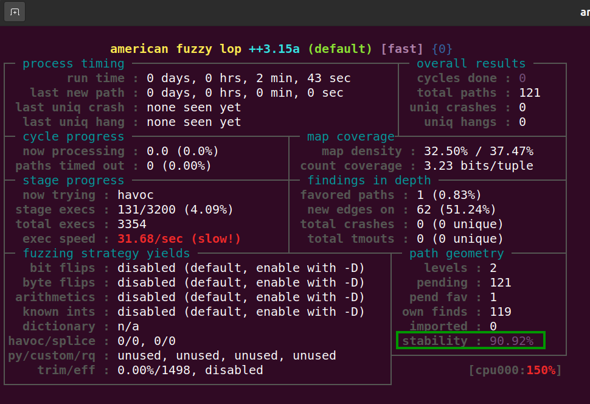

# Exercise 8 - Adobe Reader

For this exercise, we will fuzz **Adobe Reader** application. The goal is to find an Out-of-bounds vulnerability in Adobe Reader 9.5.1.

## What you will learn
Once you complete this exercise you will know:
- How to AFL++'s QEMU mode to fuzz closed-source applications
- How to enable persistent mode in QEMU mode
- How to use QASAN, a binary-only sanitizer

## Read Before Start
- I suggest you try to **solve the exercise by yourself** without checking the solution. Try as hard as you can, and only if you get stuck, check out the example solution below.
- AFL uses a non-deterministic testing algorithm, so two fuzzing sessions are never the same. That's why I highly recommend **to set a fixed seed (-s 123)**. This way your fuzzing results will be similar to those shown here and that will allow you to follow the exercises more easily.  
- If you find a new vulnerability, **please submit a security report** to the project. If you need help or have any doubt about the process, the [GitHub Security Lab](mailto:securitylab.github.com) can help you with it :)

## Contact
Are you stuck and looking for help? Do you have suggestions for making this course better or just positive feedback so that we create more fuzzing content?
Do you want to share your fuzzing experience with the community?
Join the GitHub Security Lab Slack and head to the `#fuzzing` channel. [Request an invite to the GitHub Security Lab Slack](mailto:securitylab-social@github.com?subject=Request%20an%20invite%20to%20the%20GitHub%20Security%20Lab%20Slack)

## Environment

All the exercises have been tested on **Ubuntu 20.04.2 LTS**. I highly recommend you to use **the same OS version** to avoid different fuzzing results and to run AFL++ **on bare-metal** hardware, and not virtualized machines, for best performance.

Otherwise, you can find an Ubuntu 20.04.2 LTS VMware image [here](https://drive.google.com/file/d/1_m1x-SHcm7Muov2mlmbbt8nkrMYp0Q3K/view?usp=sharing). You can also use VirtualBox instead of VMware.

The username / password for this VM are `fuzz` / `fuzz`.

## Do it yourself!
In order to complete this exercise, you need to:
1) Create a seed corpus of PDF samples
2) Enable persistent mode
3) Fuzz Adobe Reader using QEMU mode until you have some crashes
4) Triage the crashes to find a PoC for the vulnerability


**Estimated time = 8 hours**

---------------------------------------------------------------------------------------------------------------------------------------------------

<details>
  <summary>SPOILER ALERT! : Solution inside</summary>

### AFL++'s QEMU installation

First of all, we need afl-qemu installed in our system. You can check it with the following command:

```
afl-qemu-trace --help
```

and you should see something like that:


If it's not already installed, you can build and install it with:

```
sudo apt install ninja-build libc6-dev-i386
cd ~/Downloads/AFLplusplus/qemu_mode/
CPU_TARGET=i386 ./build_qemu_support.sh
make distrib
sudo make install
```

where ``/Downloads/AFLplusplus/`` is the [AFL++ root folder](../Exercise%201#install-afl)

### Adobe Reader installation

Install dependencies:
```
sudo apt-get install libxml2:i386
```

Download and uncompress ``AdbeRdr9.5.1-1_i386linux_enu.deb``:

```
wget ftp://ftp.adobe.com/pub/adobe/reader/unix/9.x/9.5.1/enu/AdbeRdr9.5.1-1_i386linux_enu.deb
```

Now, we can install it with:

```
sudo dpkg -i AdbeRdr9.5.1-1_i386linux_enu.deb
```

Then just type:

```
./opt/Adobe/Reader9/bin/acroread
```

Accept the License Agreement and you should see the Adobe Reader interface:


If you type

```
/opt/Adobe/Reader9/bin/acroread -help 
```

you can also see the list of available command line options

### Seed corpus creation

For this exercise I'll make use of a corpus downloaded from **SafeDocs "Issue Tracker" Corpus**. You can find more information about this PDF Corpus [here](https://www.pdfa.org/a-new-stressful-pdf-corpus/).

Download and uncompress the corpus:
```
wget https://corpora.tika.apache.org/base/packaged/pdfs/archive/pdfs_202002/libre_office.zip
unzip libre_office.zip -d extracted
```

Now, we will copy only files **smaller than 2 kB**, to speedup the fuzzing process:
```
mkdir -p $HOME/fuzzing_adobe/afl_in
find ./extracted -type f -size -2k \
    -exec cp {} $HOME/fuzzing_adobe/afl_in \;
```


### First approach

The simplest way to fuzz closed-source applications is just running afl-fuzz with the **-Q argument**.

You need to take care when you run afl-fuzz, because ``/opt/Adobe/Reader9/bin/acroread`` is a shell-script. The real binary path is the following one ``/opt/Adobe/Reader9/Reader/intellinux/bin/acroread``.

But if you try to execute it you will get an error like this: ``acroread must be executed from the startup script``. That's why we need to set the ``ACRO_INSTALL_DIR`` and ``ACRO_CONFIG`` envvars. We will also set ``LD_LIBRARY_PATH``to define the directory in which to search for dynamically linkable libraries.

Said that, you can run the fuzzer with the following command:
```
ACRO_INSTALL_DIR=/opt/Adobe/Reader9/Reader ACRO_CONFIG=intellinux LD_LIBRARY_PATH=$LD_LIBRARY_PATH:'/opt/Adobe/Reader9/Reader/intellinux/lib' afl-fuzz -Q -i ./afl_in/ -o ./afl_out/ -t 2000 -- /opt/Adobe/Reader9/Reader/intellinux/bin/acroread -toPostScript @@
```

And you should see AFL++ running:


Now, though, the fuzzing speed is really slow: around 7 exec/s on my machine. So, how can we improve the fuzzing speed?

And the answer is... using Persistent fuzzing!

### Persistent approach

As we see in [exercise 6](../Exercise%206), inserting the ``AFL_LOOP`` is the way that we have to tell AFL++ that we want to enable the persistent mode. In this case, however, we don't have access to the source code.

We can instead make use of the AFL_QEMU_PERSISTENT_ADDR to specify the start of the persistent loop. I advise you to set this address to the beggining of a function. You can found more information about AFL_QEMU persistent options [here](https://github.com/AFLplusplus/AFLplusplus/blob/stable/qemu_mode/README.persistent.md).

For finding an appropiate offset we can make use of a dissasembler like IDA or Ghidra. In my case, I chose the following offset ``0x08546a00``:


There is an easier alternative to use a dissasembler: to use **callgrind**.

First of all, we will install valgrind and kcachegrind with the followind command line:

```
sudo apt-get install valgrind
sudo apt-get install kcachegrind
```

Now, we can generate a callgrind report with:

```
ACRO_INSTALL_DIR=/opt/Adobe/Reader9/Reader ACRO_CONFIG=intellinux LD_LIBRARY_PATH=$LD_LIBRARY_PATH:'/opt/Adobe/Reader9/Reader/intellinux/lib' valgrind --tool=callgrind /opt/Adobe/Reader9/Reader/intellinux/bin/acroread -toPostScript [samplePDF]
```

where ``samplePDF`` is the path of a PDF sample. 

It will generate a ``callgrind.out`` output file in your current folder. Now you can visualize this report running **kachegrind**. Just type:

```
kcachegrind 
```

and you should see something like this:


I recommend you to look at the ``count`` field in kcachegrind to identify functions that only get executed 1 time, and to try to achieve an **stability score over 90%** in afl-fuzz.
  
We will set also the **AFL_QEMU_PERSISTENT_GPR=1** envvar, that will save the original value of general purpose registers and restore them in each persistent cycle.

Now, we can run the fuzzer with the following command line

```
AFL_QEMU_PERSISTENT_ADDR=0x085478AC AFL_QEMU_PERSISTENT_GPR=1 ACRO_INSTALL_DIR=/opt/Adobe/Reader9/Reader ACRO_CONFIG=intellinux LD_LIBRARY_PATH=$LD_LIBRARY_PATH:'/opt/Adobe/Reader9/Reader/intellinux/lib' afl-fuzz -Q -i ./afl_in/ -o ./afl_out/ -t 2000 -- /opt/Adobe/Reader9/Reader/intellinux/bin/acroread -toPostScript @@
```
As you can see, it gives a x4 improvement in time of execution. Not bad!



For small projects this approach might be enough. In a future exercise I will explain a faster approach: **write a custom harness**.

### Triage

In this last step we will try to find a PoC for our OOB read vulnerability.

Unfortunately, if we feed afl-qemu-trace with the crash file:

```
ACRO_INSTALL_DIR=/opt/Adobe/Reader9/Reader ACRO_CONFIG=intellinux LD_LIBRARY_PATH=$LD_LIBRARY_PATH:'/opt/Adobe/Reader9/Reader/intellinux/lib' /usr/local/bin/afl-qemu-trace -- /opt/Adobe/Reader9/Reader/intellinux/bin/acroread -toPostScript [crashFilePath] 
```

(where ``crashFilePath`` is the path of the crash file), all what we can see is a message like this


We can get a more detailes stacktrace using **QASan**. To enable it we only need to set ``AFL_USE_QASAN=1``. You can find more information about QASAN [here](https://github.com/andreafioraldi/qasan). Now we type:

```
AFL_USE_QASAN=1 ACRO_INSTALL_DIR=/opt/Adobe/Reader9/Reader ACRO_CONFIG=intellinux LD_LIBRARY_PATH=$LD_LIBRARY_PATH:'/opt/Adobe/Reader9/Reader/intellinux/lib' /usr/local/bin/afl-qemu-trace -- /opt/Adobe/Reader9/Reader/intellinux/bin/acroread -toPostScript [crashFilePath] 
```

and we will get a nicer stacktrace:


</details>
