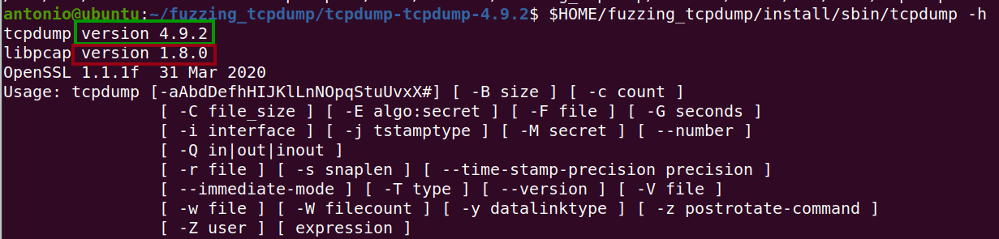
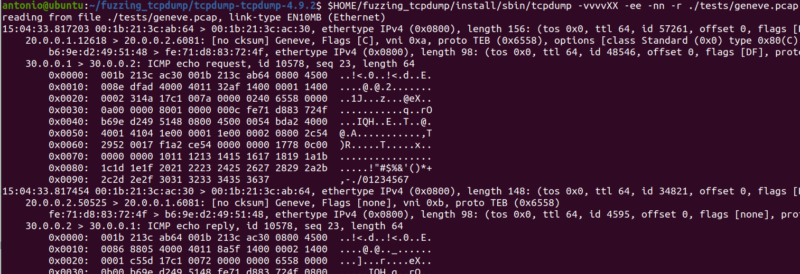
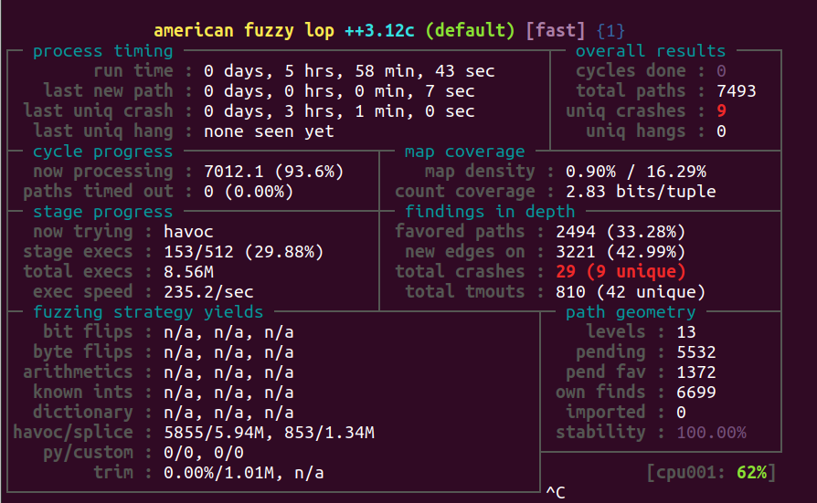
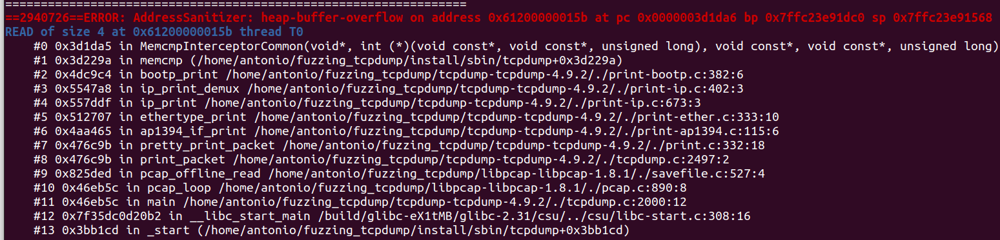

# Exercise 3 - TCPdump

In this exercise we will fuzz **TCPdump** packet analyzer. The goal is to find a crash/PoC for [**CVE-2017-13028**](https://www.cvedetails.com/cve/CVE-2017-13028/) in TCPdump 4.9.2.

<details>
  <summary>For more information about CVE-2017-13028 vulnerability, click me!</summary>
  --------------------------------------------------------------------------------------------------------
  
**CVE-2017-13028** is an Out-of-bounds Read vulneratibily that can be triggered via a BOOTP packet (Bootstrap Protocol).
  
  An Out-of-bounds Read is a vulnerability that occurs when the program reads data past the end, or before the beginning, of the intended buffer.
  
  As a result, it allows remote attackers to cause a denial of service or possibly obtain potentially sensitive information from process memory.
  
  You can find more information about Out-of-bounds Read vulnerabilities at the following link: https://cwe.mitre.org/data/definitions/125.html
  
</details>

## What you will learn
Once you complete this exercise you will know:
- What is **ASan (Address Sanitizer)**, a runtime memory error detection tool
- How to use ASAN to fuzz a target
- How much easy is to triage the crashes using ASan

## Read Before Start
- I suggest you to try to **solve the exercise by yourself** without checking the solution. Try as hard as you can, and only if you get stuck, check out the example solution below.
- AFL uses a non-deterministic testing algorithm, so two fuzzing sessions are never the same. That's why I highly recommend **to set a fixed seed (-s 123)**. This way your fuzzing results will be similar to those shown here and that will allow you to follow the exercises more easily.  
- If you find a new vulnerability, **please submit a security report** to the project. If you need help or have any doubt about the process, the [GitHub Security Lab](mailto:securitylab.github.com) can help you with it :)

## Contact
Are you stuck and looking for help? Do you have suggestions for making this course better or just positive feedback so that we create more fuzzing content?
Do you want to share your fuzzing experience with the community?
Join the GitHub Security Lab Slack and head to the `#fuzzing` channel. [Request an invite to the GitHub Security Lab Slack](mailto:securitylab-social@github.com?subject=Request%20an%20invite%20to%20the%20GitHub%20Security%20Lab%20Slack)

## Environment

All the exercises have been tested on **Ubuntu 20.04.2 LTS**. I highly recommend you to use **the same OS version** to avoid different fuzzing results and to run AFL++ **on bare-metal** hardware, and not virtualized machines, for best performance.

Otherwise, you can find an Ubuntu 20.04.2 LTS VMware image [here](https://drive.google.com/file/d/1_m1x-SHcm7Muov2mlmbbt8nkrMYp0Q3K/view?usp=sharing). You can also use VirtualBox instead of VMware.

The username / password for this VM are `fuzz` / `fuzz`.

## Do it yourself!
In order to complete this exercise, you need to:
1) Find an efficient way to fuzz TCPdump
2) Try to figure out how to enable ASan for fuzzing
3) Fuzz TCPdump until you have a few unique crashes
4) Triage the crashes to find a PoC for the vulnerability
5) Fix the issue

**Estimated time = 4 hours**

---------------------------------------------------------------------------------------------------------------------------------------------------

<details>
  <summary>SPOILER ALERT! : Solution inside</summary>

### Download and build your target

Let's first get our fuzzing target. Create a new directory for the project you want to fuzz:
```
cd $HOME
mkdir fuzzing_tcpdump && cd fuzzing_tcpdump/
```

Download and uncompress tcpdump-4.9.2.tar.gz
```
wget https://github.com/the-tcpdump-group/tcpdump/archive/refs/tags/tcpdump-4.9.2.tar.gz
tar -xzvf tcpdump-4.9.2.tar.gz
```

We also need to download libpcap, a cross-platform library that is needed by TCPdump. Download and uncompress libpcap-1.8.0.tar.gz:
```
wget https://github.com/the-tcpdump-group/libpcap/archive/refs/tags/libpcap-1.8.0.tar.gz
tar -xzvf libpcap-1.8.0.tar.gz
```

We need to rename ``libpcap-libpcap-1.8.0`` to ``libpcap-1.8.0``. Otherwise, tcpdump doesn't find the ``libpcap.a`` local path:
```
mv libpcap-libpcap-1.8.0/ libpcap-1.8.0
```
  
Build and install libpcap:

```
cd $HOME/fuzzing_tcpdump/libpcap-1.8.0/
./configure --enable-shared=no
make
```

Now, we can build and install tcpdump:
```
cd $HOME/fuzzing_tcpdump/tcpdump-tcpdump-4.9.2/
./configure --prefix="$HOME/fuzzing_tcpdump/install/"
make
make install
```

To test everything is working properly, just type:
```
$HOME/fuzzing_tcpdump/install/sbin/tcpdump -h
```
  
and you should see something like that


  
**Before continuing to the following step, check that your version numbers matches the numbers above**

### Seed corpus creation

You can find a lot of .pcacp examples in the "./tests" folder. You can run these .pcap files with the following command-line:
```
$HOME/fuzzing_tcpdump/install/sbin/tcpdump -vvvvXX -ee -nn -r [.pcap file]
```
  
For example:
```
$HOME/fuzzing_tcpdump/install/sbin/tcpdump -vvvvXX -ee -nn -r ./tests/geneve.pcap
```
  
And the output should look like

  
### AddressSanitizer
  
**AddressSanitizer (ASan)** is a fast memory error detector for C and C++. It was originally developed by Google (Konstantin Serebryany, Derek Bruening, Alexander Potapenko, Dmitry Vyukov) and first released in May 2011.

It consists of a compiler instrumentation module and a run-time library. The tool is capable of finding out-of-bounds accesses to heap, stack, and global objects, as well as use-after-free, double-free and memory leaks bugs.

AddressSanitizer is open source and is integrated with the LLVM compiler tool chain starting from version 3.1. While it was originally developed as a project for LLVM, it has been ported to GCC and it is included into GCC versions >= 4.8

You can find more information about AddressSanitizer at the following [link](https://clang.llvm.org/docs/AddressSanitizer.html).
  
### Build with ASan enabled
  
Now we're going to build tcpdump (and libpcap) with ASAN enabled.

First of all, we're going to clean all previously compiled object files and executables:
```
rm -r $HOME/fuzzing_tcpdump/install
cd $HOME/fuzzing_tcpdump/libpcap-1.8.0/
make clean

cd $HOME/fuzzing_tcpdump/tcpdump-tcpdump-4.9.2/
make clean
```

Now, we set `AFL_USE_ASAN=1` before calling ``configure`` and ``make``:

```
cd $HOME/fuzzing_tcpdump/libpcap-1.8.0/
export LLVM_CONFIG="llvm-config-11"
CC=afl-clang-lto ./configure --enable-shared=no --prefix="$HOME/fuzzing_tcpdump/install/"
AFL_USE_ASAN=1 make

cd $HOME/fuzzing_tcpdump/tcpdump-tcpdump-4.9.2/
AFL_USE_ASAN=1 CC=afl-clang-lto ./configure --prefix="$HOME/fuzzing_tcpdump/install/"
AFL_USE_ASAN=1 make
AFL_USE_ASAN=1 make install
```  

**Afl-clang-lto compilation can take a few minutes to complete**  
  
### Fuzzing time

Now, you can run the fuzzer with the following command:
```
afl-fuzz -m none -i $HOME/fuzzing_tcpdump/tcpdump-tcpdump-4.9.2/tests/ -o $HOME/fuzzing_tcpdump/out/ -s 123 -- $HOME/fuzzing_tcpdump/install/sbin/tcpdump -vvvvXX -ee -nn -r @@
```

**Note: ASAN on 64-bit systems requests a lot of virtual memory. That's why I've set the flag "-m none" that disable memory limits in AFL**
  
After a while, you should have multiple crashes:
  



### Triage
  
To debug a program built with ASan is so much easier than in the previous exercises. All you need to do is to feed the program with the crash file:
  
```
$HOME/fuzzing_tcpdump/install/sbin/tcpdump -vvvvXX -ee -nn -r '/home/antonio/fuzzing_tcpdump/out/default/crashes/id:000000,sig:06,src:002318+001583,time:10357087,op:splice,rep:8'
```

and you will get a nice summary of the crash, including the execution trace:
  
  

### Fix the issue

The last step of the exercise is to fix the bug! Rebuild your target after the fix and check that your PoC don't crash the program anymore. This last part is left as exercise for the student.
  
  <details>
  <summary>Solution inside</summary>
   --------------------------------------------------------------------------------------------------
    
  Official fix:
  - https://github.com/the-tcpdump-group/tcpdump/commit/85078eeaf4bf8fcdc14a4e79b516f92b6ab520fc#diff-05f854a9033643de07f0d0059bc5b98f3b314eeb1e2499ea1057e925e6501ae8L381
    
   </details> 

Alternatively, you can download a newer version of TCPdump, and check that both bugs have been fixed.
  
</details>
