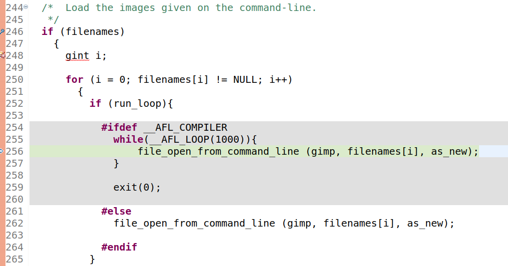
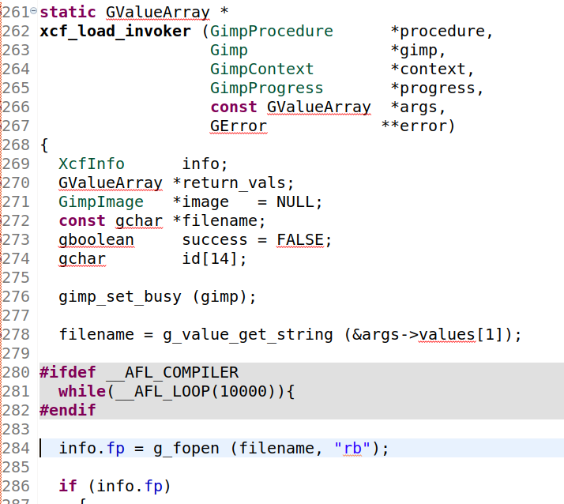
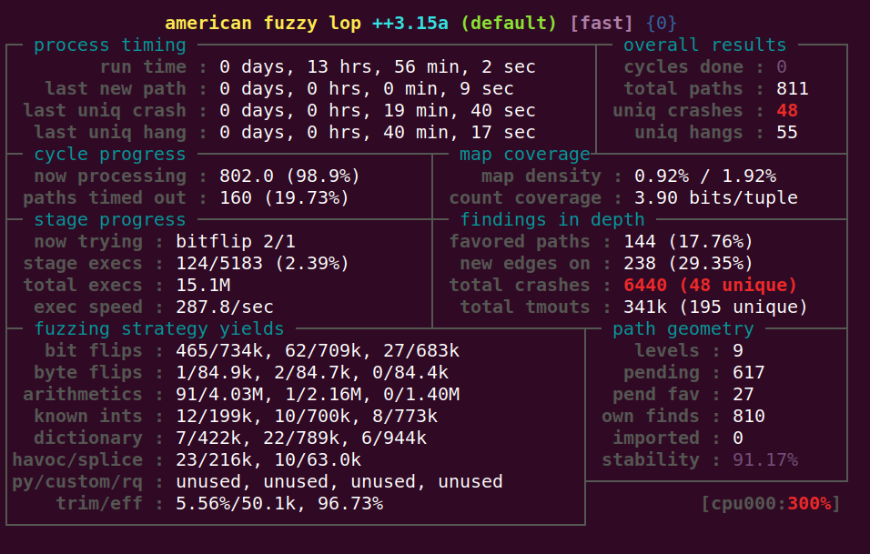
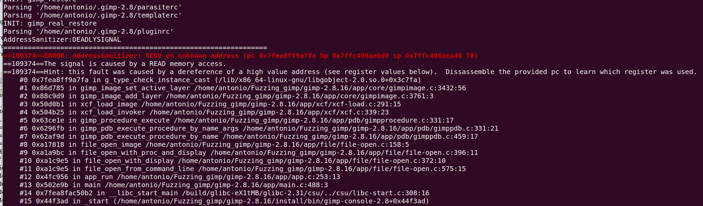

# Exercise 6 - GIMP

For this exercise, we will fuzz **GIMP** image editor. The goal is to find a crash/PoC for [**CVE-2016-4994**](https://www.cvedetails.com/cve/CVE-2016-4994/) in GIMP 2.8.16.

<details>
  <summary>For more information about CVE-2016-4994 vulnerability, click me!</summary>
  --------------------------------------------------------------------------------------------------------
  
  **CVE-2016-4994** is an Use-After-Free vulnerability that can be triggered via a crafted XCF file.
  
 Use after free errors occur when a program continues to use a pointer after it has been freed.
  
 This can have any number of adverse consequences, ranging from the corruption of valid data to the execution of arbitrary code.
 
 You can find more information about Use-After-Free vulnerabilities at the following link: https://cwe.mitre.org/data/definitions/416.html
  
</details>


## What you will learn
Once you complete this exercise you will know:
- How to use persistent mode to speed up fuzzing
- How to fuzz interactive / GUI applications 

## Read Before Start
- I suggest you to try to **solve the exercise by yourself** without checking the solution. Try as hard as you can, and only if you get stuck, check out the example solution below.
- AFL uses a non-deterministic testing algorithm, so two fuzzing sessions are never the same. That's why I highly recommend **to set a fixed seed (-s 123)**. This way your fuzzing results will be similar to those shown here and that will allow you to follow the exercises more easily.  
- If you find a new vulnerability, **please submit a security report** to the project. If you need help or have any doubt about the process, the [GitHub Security Lab](mailto:securitylab.github.com) can help you with it :)

## Contact
Are you stuck and looking for help? Do you have suggestions for making this course better or just positive feedback so that we create more fuzzing content?
Do you want to share your fuzzing experience with the community?
Join the GitHub Security Lab Slack and head to the `#fuzzing` channel. [Request an invite to the GitHub Security Lab Slack](mailto:securitylab-social@github.com?subject=Request%20an%20invite%20to%20the%20GitHub%20Security%20Lab%20Slack)

## Environment

All the exercises have been tested on **Ubuntu 20.04.2 LTS**. I highly recommend you to use **the same OS version** to avoid different fuzzing results and to run AFL++ **on bare-metal** hardware, and not virtualized machines, for best performance.

Otherwise, you can find an Ubuntu 20.04.2 LTS VMware image [here](https://drive.google.com/file/d/1_m1x-SHcm7Muov2mlmbbt8nkrMYp0Q3K/view?usp=sharing). You can also use VirtualBox instead of VMware.

The username / password for this VM are `fuzz` / `fuzz`.

## Persistent mode

The AFL persistent mode is based on **in-process fuzzers**: fuzzers that make use of a single one process, injecting code into the target process and changing the input values in memory.

afl-fuzz supports a working mode that combines the benefits of in-process fuzzing with the robustness of a more traditional multi-process tool: **the Persistent Mode**.

In persistent mode, AFL++ fuzzes a target multiple times in a single forked process, instead of forking a new process for each fuzz execution. This mode can improve the fuzzing speed up to 20X times.

The basic structure of the target would be as follows:
```C
  //Program initialization

  while (__AFL_LOOP(10000)) {

    /* Read input data. */
    /* Call library code to be fuzzed. */
    /* Reset state. */
  }
  
  //End of fuzzing
  
```

You can find more information about AFL++ persistent mode at: https://github.com/AFLplusplus/AFLplusplus/blob/stable/instrumentation/README.persistent_mode.md

## Do it yourself!
In order to complete this exercise, you need to:
1) Find an efficient way of modifying GIMP source code to enable AFL persistent mode
2) Create a seed corpus of XCF samples
3) Optional: Create a fuzzing dictionary for the XCF file format
4) Fuzz GIMP until you have a few unique crashes. I recommend you to use as many AFL instances as possible (CPU cores)
5) Triage the crashes to find a PoC for the vulnerability
6) Fix the issues
7) Bonus: Find some of the other minor bugs

**Estimated time = 7 hours**

---------------------------------------------------------------------------------------------------------------------------------------------------

<details>
  <summary>SPOILER ALERT! : Solution inside</summary>

### Download and build your target
  
Let's first get our fuzzing target. Create a new directory for the project you want to fuzz:
```
cd $HOME
mkdir Fuzzing_gimp && cd Fuzzing_gimp
```
  
Now, install the required dependencies:
```
sudo apt-get install build-essential libatk1.0-dev libfontconfig1-dev libcairo2-dev libgudev-1.0-0 libdbus-1-dev libdbus-glib-1-dev libexif-dev libxfixes-dev libgtk2.0-dev python2.7-dev libpango1.0-dev libglib2.0-dev zlib1g-dev intltool libbabl-dev
```

We also need **GEGL 0.2(Generic Graphics Library)**. Unfortunately, we cannot find the gegl-0.2.0 package in our Ubuntu distribution. So, we need to download and build this library from source code. Just type:
```
wget https://download.gimp.org/pub/gegl/0.2/gegl-0.2.0.tar.bz2
tar xvf gegl-0.2.0.tar.bz2 && cd gegl-0.2.0
```
  
Now, we need to make two minor changes in the source code:
```
sed -i 's/CODEC_CAP_TRUNCATED/AV_CODEC_CAP_TRUNCATED/g' ./operations/external/ff-load.c
sed -i 's/CODEC_FLAG_TRUNCATED/AV_CODEC_FLAG_TRUNCATED/g' ./operations/external/ff-load.c
```

Build and install Gegl-0.2:  
```
./configure --enable-debug --disable-glibtest  --without-vala --without-cairo --without-pango --without-pangocairo --without-gdk-pixbuf --without-lensfun --without-libjpeg --without-libpng --without-librsvg --without-openexr --without-sdl --without-libopenraw --without-jasper --without-graphviz --without-lua --without-libavformat --without-libv4l --without-libspiro --without-exiv2 --without-umfpack
make -j$(nproc)
sudo make install
```
Don't worry if you see some error messages in the testing stage.

Now, we download and uncompress GIMP 2.8.16:
```
cd ..
wget https://mirror.klaus-uwe.me/gimp/pub/gimp/v2.8/gimp-2.8.16.tar.bz2
tar xvf gimp-2.8.16.tar.bz2 && cd gimp-2.8.16/
```
  
Time for building GIMP using **afl-clang-lto** as the compiler (it can take some time): 
```
CC=afl-clang-lto CXX=afl-clang-lto++ PKG_CONFIG_PATH=$PKG_CONFIG_PATH:$HOME/Fuzzing_gimp/gegl-0.2.0/ CFLAGS="-fsanitize=address" CXXFLAGS="-fsanitize=address" LDFLAGS="-fsanitize=address" ./configure --disable-gtktest --disable-glibtest --disable-alsatest --disable-nls --without-libtiff --without-libjpeg --without-bzip2 --without-gs --without-libpng --without-libmng --without-libexif --without-aa --without-libxpm --without-webkit --without-librsvg --without-print --without-poppler --without-cairo-pdf --without-gvfs --without-libcurl --without-wmf --without-libjasper --without-alsa --without-gudev --disable-python --enable-gimp-console --without-mac-twain --without-script-fu --without-gudev --without-dbus --disable-mp --without-linux-input --without-xvfb-run --with-gif-compression=none --without-xmc --with-shm=none --enable-debug  --prefix="$HOME/Fuzzing_gimp/gimp-2.8.16/install"
make -j$(nproc)
make install
```
  
### Persistent mode
  
There are two very simple approaches:
  
- The first one is to modify the ``app.c`` file and include the AFL_LOOP macro into the for loop:
  

  
- The second one is to insert the AFL_LOOP macro inside the ``xcf_load_invoker`` function:
  

  
While the first one allows us to target different input formats, the second is faster and we will have more chances to catch the bug.
  
You can download the patch for the second one [here](./persistent.patch)
  
### Seed corpus creation
  
I recommend you to create multiple GIMP projects and save them to obtain multiple .xcf samples  

Alternatively, you can just copy the [SampleInput.xcf](./SampleInput.xcf) file to your AFL input folder
  
### Fuzzing time

Since the vulnerability affects GIMP core, we can save some startup time by removing plugins that we don't need:
```
rm ./install/lib/gimp/2.0/plug-ins/*
```
  
Now, you can run the fuzzer with the following command:
```
ASAN_OPTIONS=detect_leaks=0,abort_on_error=1,symbolize=0 afl-fuzz -i './afl_in' -o './afl_out' -D -t 100 -- ./install/bin/gimp-console-2.8 --verbose -d -f @@
```
  
Some notes:
- `gimp-console-2.8` is a console-only version of GIMP
- I recommend enabling deterministic mutations (-D)
- There is also an infinite loop bug in the code, so we need to set a low timeout limit (ex. -t 100). This timeout limit depends on your machine capabilites, so you will need to adjust it for your particular case.

  
After a while, you should have multiple crashes:
  

### Triage
  
The ASan trace may look like:
  
  
  
### Fix the issues
  
The last step of the exercise is to fix both bugs. Rebuild your target after the fixes and check that your PoCs don't crash the program anymore. This last part is left as an exercise for the student.
  
  <details>
  <summary>Solution inside</summary>
   --------------------------------------------------------------------------------------------------
    
  Official fixes:
    
  - https://gitlab.gnome.org/GNOME/gimp/-/commit/6d804bf9ae77bc86a0a97f9b944a129844df9395
    
   </details> 

Alternatively, you can download a newer version of GIMP, and check that both bugs have been fixed.
  
  
### Bonus

There are other minor bugs in the code. I've found:

- A null dereference bug
- An infinite loop bug
- A memory exhaustion bug

I encourage you to try to find all of them!
  
</details>
