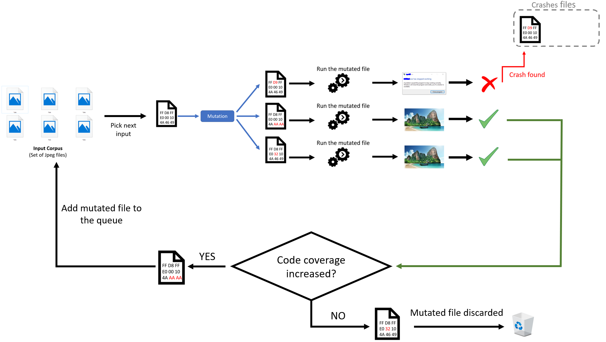

# Fuzzing-101

Do you want to learn how to fuzz like a real expert, but don't know how to start?

If so, this is the course for you!

**10 real targets, 10 exercises.** Are you able to solve all 10?

## Structure

| Exercise No.  | Target | Time estimated | Main topics |
| ------------- | ------------- | ------------- | ------------- |
| [Exercise 1](https://github.com/antonio-morales/Fuzzing101/tree/main/Exercise%201) | Xpdf  | 120 mins | afl-clang-fast, afl-fuzz, GDB |
| Exercise 2  | will be released soon  | | |
| Exercise 3  | will be released soon  | | |
| Exercise 4  | will be released soon  | | |
| Exercise 5  | will be released soon  | | |
| Exercise 6  | will be released soon  | | |
| Exercise 7  | will be released soon  | | |
| Exercise 8  | will be released soon  | | |
| Exercise 9  | will be released soon  | | |
| Exercise 10  | will be released soon  || |

## Who is the course intended for?
- Anyone wishing to learn fuzzing basics
- Anyone who wants to learn to find vulnerabilities in real software projects.

## Requirements
- All you need for this course is a running Linux system with an internet connection. You will find a suitable VMware image in the exercises.
- Basic Linux skills are desirable.
- All the exercises have been tested in Ubuntu **20.04.2 LTS**. You can download it from [here](https://ubuntu.com/download/desktop/thank-you?version=20.04.2.0&architecture=amd64)
- In this course we're going to use [AFL++](https://github.com/AFLplusplus/AFLplusplus), a newer and superior fork of Michał Zalewski's AFL, for solving the fuzzing exercises.

## What is fuzzing?

**Fuzz testing (or fuzzing)** is an automated software testing technique that is based on feeding the program with random/mutated input values and monitoring it for exceptions/crashes.

[AFL](https://github.com/google/AFL), [libFuzzer](https://llvm.org/docs/LibFuzzer.html) and [HonggFuzz](https://github.com/google/honggfuzz) are three of the most successful fuzzers when it comes to real world applications. All three are examples of **Coverage-guided evolutionary** fuzzers.

###  Coverage-guided evolutionary fuzzer

- **Evolutionary**: is a metaheuristic approach inspired by evolutionary algorithms, which basically consists in the evolution and mutation of the initial subset over time, by using a selection criteria (ex. coverage).

- **Coverage-guided**: To increase the chance of finding new crashes, coverage-guided fuzzers gather and compare code coverage data between different inputs (usually through instrumentation) and pick those inputs which lead to new execution paths.

  Simplification of the functioning of a coverage-guided evolutionary fuzzer

## Thanks

Thanks for their help:
- [Xavier RENE-CORAIL](https://github.com/xcorail)
- [Alan Vivona](https://github.com/alanvivona)
- [Jason White](https://github.com/misfir3)
- [Octavio Gianatiempo](https://github.com/ogianatiempo)

## Contact

Are you stuck and looking for help? Do you have suggestions for making this course better or just positive feedback so that we create more similar content?
Do you want to share your fuzing experience with the community?
Join the GitHub Security Lab Slack and head to the `#fuzzing` channel. [Request an invite to the GitHub Security Lab Slack](mailto:securitylab-social@github.com?subject=Request%20an%20invite%20to%20the%20GitHub%20Security%20Lab%20Slack)

